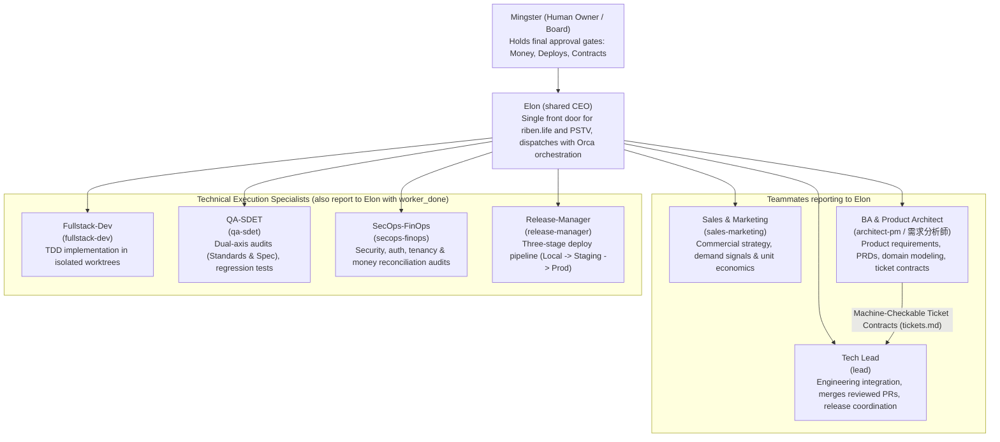
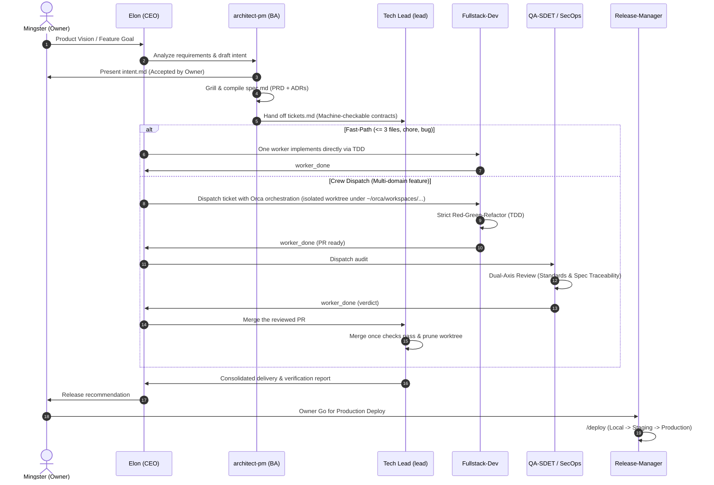

# Agent Team Architecture & Operating Model

This document outlines the organization, operating workflow, and decision governance of our autonomous AI Agent Team across projects (**riben.life**, **PSTV**, and future adoptions). The canonical, current copies live in each project: `docs/agents/team.md` and `.claude/model-routing.md`. This file is the overview, so when it disagrees with them, they win.

---

## 1. Executive Organization & Command Hierarchy

Mingster talks only to **Elon (`elon`)**, the single front door and the shared CEO of riben.life and PSTV. Elon delegates to teammates, every teammate reports to Elon, and Elon reports to Mingster. The team has nine roles in riben.life (Elon, the Tech Lead `lead`, and seven specialists) and ten in PSTV (the same plus `stream-health`).

Not drawn: `support-csm` (customer support and success) in both projects, and `stream-health` (streaming and infrastructure checks) in PSTV only. Each reports to Elon the same way.

---

## 2. Pillar Responsibilities & Decision Boundaries

### Board (`Mingster`) & Primary Interface
- **Primary Human Interaction is with Elon (`/elon` or `/ceo`)**:
  - The human owner speaks directly to the CEO as the executive peer and strategic sounding board.
  - Elon translates vision into commercial experiments (Sales), requirements analysis (BA), and technical delivery (Tech Lead and workers).
- Retains ultimate approval over:
  - Permanent pricing, discounting, or plan fee terms.
  - Irreversible production data migrations or schema drops.
  - Production deployments (gated go/no-go).
  - External spending or advertising commitments.

### Executive Orchestrator: Elon (`elon` / `/elon`)
- **Direct Executive Partner to Mingster**:
  - Objective-driven and critical: challenges weak assumptions without yes-man flattery.
  - Plans, dispatches every teammate with Orca orchestration (skill `orchestration`, `orca orchestration worker-start`, `check`, `worker-release`), collects each `worker_done` report, and reports back to Mingster. Elon never uses Claude subagents or experimental agent teams for this.
  - Usage gate: before every `worker-start`, Elon runs `usage-gate.py check --provider <provider>`. A provider that has used its daily cap (12% of its weekly limit), counted with a reserve of 1% of the week per worker already running on it, is skipped for the next one in the fallback order.
  - Commands: Use `/elon <goal>` or `/ceo <goal>` to initiate goals, strategy discussions, or high-level status inquiries.
  - Standard output format: **Now** (accomplished), **Needs owner** (decisions requiring board approval), **Running** (active agents and pipelines).

### Pillar 1: Sales & Marketing (`sales-marketing`)
- **Reports to Elon**.
- Validates market demand and analyzes user acquisition channels (CAC, LTV, churn, activation).
- Supplies evidence-based problem definitions for product intake.
- *Strict boundary*: Never sends unapproved marketing emails, touches production ledgers, or offers unapproved discounts.

### Pillar 2: Business Analysis & Product Architecture (`architect-pm` / 需求分析師)
- **Reports to Elon** for product requirements; collaborates with Tech Lead for technical handoffs.
- Transforms business pain points and owner vision into `intent.md` $\rightarrow$ `spec.md` (PRD).
- Decomposes accepted specs into **Machine-Checkable Ticket Contracts** (`tickets.md`).
- *Strict boundary*: Never writes application code; focuses purely on domain modeling, requirements boundaries, and contract definitions.

### Pillar 3: Engineering Orchestration (`tech-lead`)
- **A teammate that reports to Elon** for delivery status and capacity.
- Coordinates engineering integration: merges reviewed PRs, keeps branches and worktrees clean, coordinates releases, and starts and supervises engineering workers in Orca.
- Receives machine-checkable ticket contracts from the BA and runs the same usage gate as Elon before every `worker-start`.
- *Merging*: Merges eagerly. As soon as QA (plus SecOps or stream-health where required) has no blocking comments, checks are green and the PR is mergeable, the Tech Lead merges without waiting for the owner, never with `--admin`. PRs that accept an intent or spec, production deploys outside the standing go, and migrations still go to the owner.

---

## 3. End-to-End Delivery Lifecycle (6-Stage SDLC)

---

## 4. Machine-Checkable Ticket & Review Contracts

To eliminate agent wandering, context sprawl, and unexpected bugs, work handoffs strictly use machine-checkable boundaries:

### The Ticket Contract (`tickets.md`)
Each ticket generated by the BA must define:
1. **Allowed files / scope boundaries**: Exact whitelist of files or subdirectories the agent may touch. Any edit outside this whitelist fails review.
2. **Verification command**: Exact deterministic test command that gates the ticket (e.g., `bun test --isolate <path>`, `bun run lint`).
3. **Blast radius & reversibility**: Scope impact assessment (Low / Medium / High) and rollback notes.

### The Dual-Axis Review Contract
Every code change must pass two independent axes before merge:
- **Standards Axis**: Conformance to project conventions (`AGENTS.md`), safe-actions only in `"use server"`, tenant/store scoping, BigInt epochs, and Fowler code smells.
- **Spec Axis**: Verification that all acceptance criteria are met, only allowlisted files were touched, and **zero scope creep** occurred.

---

## 5. Persistent Memory Layer (`task_plan.md` & `progress.md`)

To prevent LLM amnesia, context drift, or hallucinations during multi-step automated execution, every worker session maintains two lightweight, persistent files:

1. **`task_plan.md` (Static Contract & Roadmap)**:
   - Written *before* modifying code.
   - Declares the objective, allowed file whitelist, verification command (`bun test --isolate <path>`), and tracer-bullet steps.
2. **`progress.md` (Dynamic State Ledger)**:
   - Updated after each meaningful step or test run.
   - Records current status, discoveries, test outputs, decisions made, and strike counts.
   - *Compaction Resilience*: When context is compressed or a worker restarts, reading these two files restores exact state in 1 turn with zero drift.

See full template and examples at `docs/agents/persistent-memory-protocol.md`.

---

## 6. Token Efficiency & FinOps Rules (Lean Startup SDLC)

1. **Model and Effort**: Pick the tier by task, not by habit: Strong reasoning for ambiguous decisions, specs, and security or financial review; Workhorse for implementation, coordination, QA, release, and support. Exact flags per provider are in `.claude/model-routing.md`.
2. **Usage Gate**: Before every `worker-start`, run `usage-gate.py check --provider <provider>`. Exit 3 means the provider hit its daily cap (12% of its weekly limit) or the week is 95% used, so use the next provider in the fallback order, or stop dispatching and report it. The `script/usage-gate-hook.py` PreToolUse hook enforces this for claude and codex: it denies a blocked `worker-start` and names the reset time in local time. How the numbers work: the gate reads the provider's own weekly percentage (codex: newest `rate_limits` event in `~/.codex/sessions`; claude: the statusline's `rate_limits.seven_day`), "used today" is that percentage minus its value at the start of the local day (codex: last event before midnight; claude: the first statusline reading of the day; a week that began today counts from 0), and a reading older than 6 hours counts as no reading except against the 95% ceiling. The percentage is the whole account's, so sessions outside Orca count. A start is refused when used today plus the reserve reaches the cap, where the reserve is 1% of the week per running worker (`orca orchestration worker-list`). The gate checks only at `worker-start` and never stops a running worker. `usage-gate.py show` prints every provider as one table (`--json` for the raw rows).
3. **Three-Strike Hard Stop**: When fixing the same bug, type error, or test failure reaches 3 attempts, halt immediately. Log errors and attempted solutions in `active_run.md` under `[Blockers]` and wait for human input.
4. **On-Demand Memory**: Never load `learned.md` or `experiences/` blindly at session start. Grep on-demand only when tackling known domain gotchas.
5. **Worktree Lifecycle**: Child worktrees belong in `~/orca/workspaces/<project>/<lane>`. When integrated or abandoned, prune them immediately (`git worktree remove`) so directories never accumulate. Release each finished worker with `orca orchestration worker-release --dispatch <id>`, even when its outcome is `failed`.
6. **Lean State Artifacts**: Reference `docs/agents/lean-startup-sdlc.md` for `active_run.md` format and zero-env disclosures. Living specs remain in the project's SDLC intent or spec folders.
7. **Context Hygiene & Session Lifecycles**:
   - **One Ticket, One Session**: Workers exit cleanly once their PR is opened and verified. Never chain unrelated tasks in an old session; start fresh sessions for new tickets.
   - **In-Task Compaction Readiness**: Maintain `active_run.md` continuously so human operators can run `/compact` during long tasks without losing execution state.
   - **Side Worker Offloading**: Elon and the Tech Lead delegate heavy file reading and test sweeps to Orca workers, absorbing only compact diff stats and exit codes.
   - **Spike Isolation**: Test speculative fixes in disposable worktrees or forked sessions. Discard failed explorations rather than polluting main thread history.

---

## 7. Multi-Provider Compatibility in Orca ADE

The Agent Team runs inside **Orca ADE**. Every provider is driven the same way, by Orca orchestration: `orca orchestration worker-start --agent <provider> --model <id> --effort <level>`, with each worker sending `worker_done` to Elon. Model names and flags change often, so they are kept only in `.claude/model-routing.md` of each project.

Provider fallback order: **Claude, then Codex, then Cursor, then Antigravity.**

| Provider | Role Loading Mechanism | Notes |
| :--- | :--- | :--- |
| **Claude** | Role files in `.claude/agents/*.md` | Default for most roles. Role file `model:` and `effort:` apply only when run as `claude --agent <role>`. |
| **Codex** | The spec tells the worker to read `.claude/agents/<role>.md` first | Runs without the Claude hooks, so the strike rule in `AGENTS.md` is the guard. |
| **Cursor** | Same as Codex, plus `.cursor/rules/` | Effort is part of the model id. New worktrees need workspace trust. |
| **Antigravity** | Same as Codex, plus project `AGENTS.md` and `.agents/skills/` | Effort is part of the model id. |

### Universal Rules across all Providers:
1. **Fallback**:
   - A provider is unavailable on quota exhaustion, a long rate limit, an auth error, or an outage. Rerun the task on the next provider in the order above, and never downgrade silently.
   - Check the usage gate before each start. Finish a task on the provider where it landed, and start the next task on the preferred provider again.
2. **Single Source of Truth**:
   - `AGENTS.md` at repo root is the single source for conventions.
   - Roles in `.claude/agents/` define persona boundaries across all providers.
   - Skills provide cross-platform procedural workflows in three tiers. General skills (`orchestration`, `to-tickets`, `create-pr`, `tdd` and the rest) come only from dotfiles through `~/.claude/skills` and `~/.agents/skills`. Team skills (`elon`, `ceo`, `crew`, `tl`, `deploy`) are committed, generated copies in each project's `.agents/skills/`, written by `~/dotfiles/script/sync-team-skills.sh`, and read product facts from `docs/agents/team-facts.md` and `docs/agents/deploy-facts.md`. Project-only skills stay in the project. Details: `docs/agents/skills-inventory.md`.
3. **Workspace Isolation in Orca ADE**:
   - Always route child worktrees to `~/orca/workspaces/<project>/<lane>`.
   - Never use `/tmp` or `.claude/worktrees`.
   - Always clean up merged worktrees with `git worktree remove`.

---

## 8. Shared vs per project

The generic source is `~/dotfiles/templates/agent-team/`. Each project holds filled in copies of it (`docs/agents/team.md`, `.claude/agents/`, `.claude/model-routing.md`), and the copy in the project is what its agents follow. The team skills are the exception: their project copies are generated, never edited in place. Edit them in `templates/agent-team/.agents/skills/` and run `script/sync-team-skills.sh <project>`; `--check` fails when a project copy drifts.

What may differ per project:
- Hostnames, environments, and deploy stages (for example PSTV's staging and production hosts).
- ADR numbers (riben.life cites ADR 0058 and 0060, PSTV cites fileServer ADR 0002 and 0004).
- Product wording, language rules, and domain terms.
- Extra roles (PSTV adds `stream-health`).

What stays the same: Elon as the single front door, Orca orchestration with `worker_done` reports, the usage gate, the provider fallback order, eager merging by the Tech Lead, and the gated actions held by the owner.
