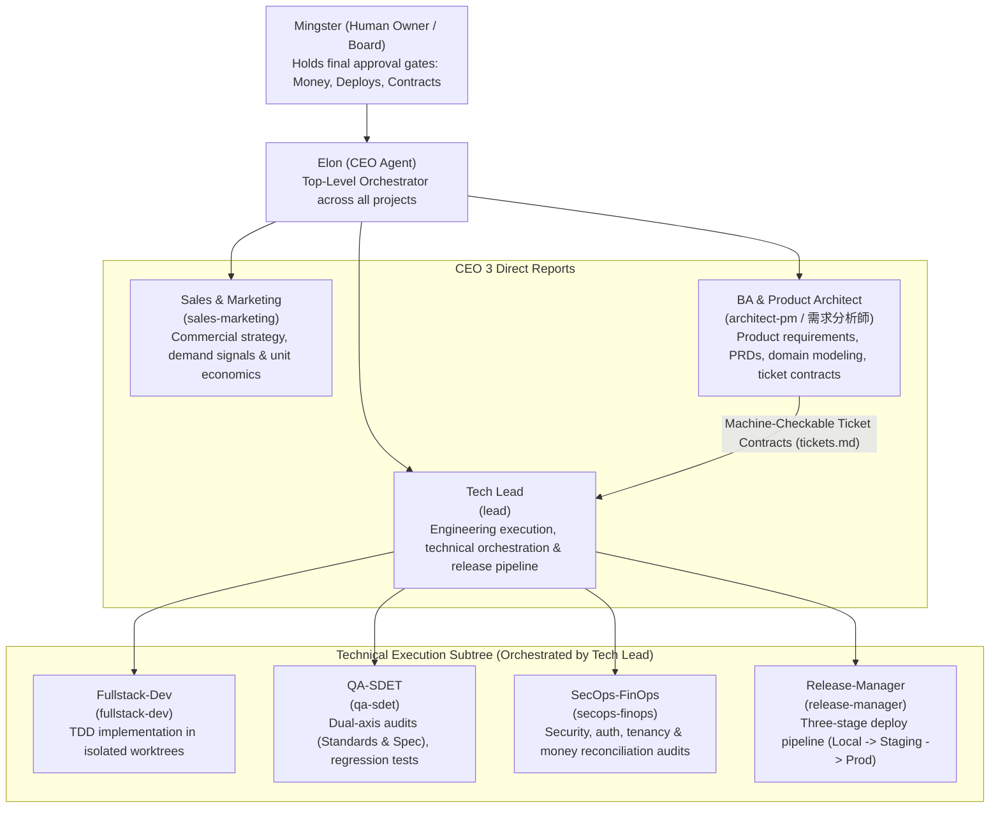
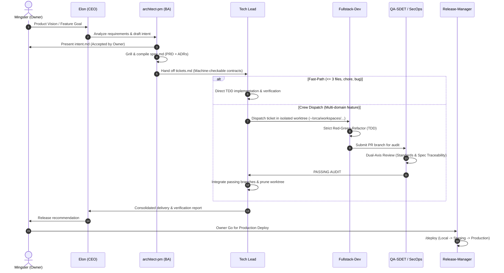

# Agent Team Architecture & Operating Model

This document outlines the organization, operating workflow, and decision governance of our autonomous AI Agent Team across projects (**riben.life**, **PSTV**, and future adoptions).

---

## 1. Executive Organization & Command Hierarchy

The team is structured into three executive pillars reporting directly to the **CEO (`elon`)**, who reports to the **Human Owner / Board (`Mingster`)**.

---

## 2. Pillar Responsibilities & Decision Boundaries

### Board (`Mingster`) & Primary Interface
- **Primary Human Interaction is with Elon (`/elon` or `/ceo`)**:
  - The human owner speaks directly to the CEO as the executive peer and strategic sounding board.
  - Elon translates vision into commercial experiments (Sales), requirements analysis (BA), and technical delivery (Tech Lead).
- Retains ultimate approval over:
  - Permanent pricing, discounting, or plan fee terms.
  - Irreversible production data migrations or schema drops.
  - Production deployments (gated go/no-go).
  - External spending or advertising commitments.

### Executive Orchestrator: Elon (`elon` / `/elon`)
- **Direct Executive Partner to Mingster**:
  - Objective-driven and critical: challenges weak assumptions without yes-man flattery.
  - Orchestrates the three direct reports: Sales, BA (`architect-pm`), and Tech Lead (`lead`).
  - Commands: Use `/elon <goal>` or `/ceo <goal>` to initiate goals, strategy discussions, or high-level status inquiries.
  - Standard output format: **Now** (accomplished), **Needs owner** (decisions requiring board approval), **Running** (active agents and pipelines).

### Pillar 1: Sales & Marketing (`sales-marketing`)
- **Direct report to CEO**.
- Validates market demand and analyzes user acquisition channels (CAC, LTV, churn, activation).
- Supplies evidence-based problem definitions for product intake.
- *Strict boundary*: Never sends unapproved marketing emails, touches production ledgers, or offers unapproved discounts.

### Pillar 2: Business Analysis & Product Architecture (`architect-pm` / 需求分析師)
- **Direct report to CEO** for product requirements; collaborates with Tech Lead for technical handoffs.
- Transforms business pain points and owner vision into `intent.md` $\rightarrow$ `spec.md` (PRD).
- Decomposes accepted specs into **Machine-Checkable Ticket Contracts** (`tickets.md`).
- *Strict boundary*: Never writes application code; focuses purely on domain modeling, requirements boundaries, and contract definitions.

### Pillar 3: Engineering Orchestration (`tech-lead`)
- **Direct report to CEO** for delivery status and capacity.
- Orchestrates technical specialists (`fullstack-dev`, `qa-sdet`, `release-manager`).
- Receives machine-checkable ticket contracts from the BA, provisions isolated worktrees, and controls merge integration.
- *Strict boundary*: Never self-merges unreviewed application changes; relies on independent QA/SecOps gates.

---

## 3. End-to-End Delivery Lifecycle (6-Stage SDLC)

---

## 4. Machine-Checkable Ticket & Review Contracts

To eliminate agent wandering, context sprawl, and unexpected bugs, work handoffs strictly use machine-checkable boundaries:

### The Ticket Contract (`tickets.md`)
Each ticket generated by the BA must define:
1. **Allowed files / scope boundaries**: Exact whitelist of files or subdirectories the agent may touch. Any edit outside this whitelist fails review.
2. **Verification command**: Exact deterministic test command that gates the ticket (e.g., `bun test --isolate <path>`, `bun run lint`).
3. **Blast radius & reversibility**: Scope impact assessment (Low / Medium / High) and rollback notes.

### The Dual-Axis Review Contract
Every code change must pass two independent axes before merge:
- **Standards Axis**: Conformance to project conventions (`AGENTS.md`), safe-actions only in `"use server"`, tenant/store scoping, BigInt epochs, and Fowler code smells.
- **Spec Axis**: Verification that all acceptance criteria are met, only allowlisted files were touched, and **zero scope creep** occurred.

---

## 5. Persistent Memory Layer (`task_plan.md` & `progress.md`)

To prevent LLM amnesia, context drift, or hallucinations during multi-step automated execution, every worker session and crew lane maintains two lightweight, persistent files:

1. **`task_plan.md` (Static Contract & Roadmap)**:
   - Written *before* modifying code.
   - Declares the objective, allowed file whitelist, verification command (`bun test --isolate <path>`), and tracer-bullet steps.
2. **`progress.md` (Dynamic State Ledger)**:
   - Updated after each meaningful step or test run.
   - Records current status, discoveries, test outputs, decisions made, and strike counts.
   - *Compaction Resilience*: When context is compressed or a subagent restarts, reading these two files restores exact state in 1 turn with zero drift.

See full template and examples at `docs/agents/persistent-memory-protocol.md`.

---

## 6. Token Efficiency & FinOps Rules (Lean Startup SDLC)

1. **Default Model**: Sonnet with `medium` effort for execution, coordination, QA, and operations. Reserve `high` effort strictly for complex multi-domain architecture (`architect-pm`) or security/financial audits (`secops-finops`).
2. **Cost Gate / Token Circuit Breaker (3 Turns)**: Autonomous execution loops have a hard limit of **3 turns** before taking a progress snapshot in `active_run.md` and confirming with the owner to continue.
3. **Three-Strike Hard Stop**: When fixing the same bug, type error, or test failure reaches 3 attempts, halt immediately. Log errors and attempted solutions in `active_run.md` under `[Blockers]` and wait for human input.
4. **On-Demand Memory**: Never load `learned.md` or `experiences/` blindly at session start. Grep on-demand only when tackling known domain gotchas.
5. **Worktree Lifecycle**: Child worktrees belong in `~/orca/workspaces/<project>/<lane>`. When integrated or abandoned, prune them immediately (`git worktree remove`) so directories never accumulate.
6. **Lean State Artifacts**: Reference `docs/agents/lean-startup-sdlc.md` for `active_run.md` format and zero-env disclosures. Living specs remain in the project's SDLC intent or spec folders.
7. **Context Hygiene & Session Lifecycles**:
   - **One Ticket, One Session**: Workers exit cleanly once their PR is opened and verified. Never chain unrelated tasks in an old session; start fresh sessions for new tickets.
   - **In-Task Compaction Readiness**: Maintain `active_run.md` continuously so human operators can run `/compact` during long tasks without losing execution state.
   - **Side Subagent Offloading**: Lead sessions delegate heavy file reading and test sweeps to side workers, absorbing only compact diff stats and exit codes.
   - **Spike Isolation**: Test speculative fixes in disposable worktrees or forked sessions. Discard failed explorations rather than polluting main thread history.

---

## 7. Multi-Provider Compatibility in Orca ADE

The Agent Team runs natively inside **Orca ADE** across multiple AI model providers and agent harnesses:

| Runtime / Harness | Entry Point | Role Loading Mechanism | Multi-Agent Execution in Orca ADE |
| :--- | :--- | :--- | :--- |
| **Claude Code** (Anthropic Claude 3.7 / 3.5) | `/tl` or `/crew <objective>` | Loads markdown definitions from `.claude/agents/*.md` | Uses Claude experimental agent teams (`CLAUDE_CODE_EXPERIMENTAL_AGENT_TEAMS`) with split-pane terminals via `orca claude-teams`. |
| **Codex** (OpenAI / Cursor / o3-mini / GPT-4o) | `/tl` or `/crew <objective>` | Discovers agent skills from `.agents/skills/` and rules from `.cursor/rules/` | Executes in Orca child worktrees (`~/orca/workspaces/<project>/<lane>`). Dispatches parallel subagents via Codex SDK or IDE Agent mode. |
| **Antigravity** (Google DeepMind Gemini 2.5 Pro/Flash) | `/tl` or `/crew <objective>` | Reads project `AGENTS.md` and discovers skills in `.agents/skills/` | Employs `invoke_subagent` and native reactive messaging. Tasks run in isolated Orca sandboxes with deterministic terminal tools. |

### Universal Rules across all Providers:
1. **Model Aliasing**:
   - Claude: `sonnet` (effort: `medium` / `high`)
   - Codex: `gpt-5-codex` / `o3-mini` (reasoning effort: `medium`)
   - Antigravity: `gemini-2.5-pro` (or inherited runtime flash/pro)
2. **Single Source of Truth**:
   - `AGENTS.md` at repo root is the single source for conventions.
   - Roles in `.claude/agents/` define persona boundaries across all harnesses.
   - Skills in `.agents/skills/` (`crew`, `to-tickets`, `create-pr`, `deploy`) provide cross-platform procedural workflows.
3. **Workspace Isolation in Orca ADE**:
   - Always route child worktrees to `~/orca/workspaces/<project>/<lane>`.
   - Never use `/tmp` or `.claude/worktrees`.
   - Always clean up merged worktrees with `git worktree remove`.
